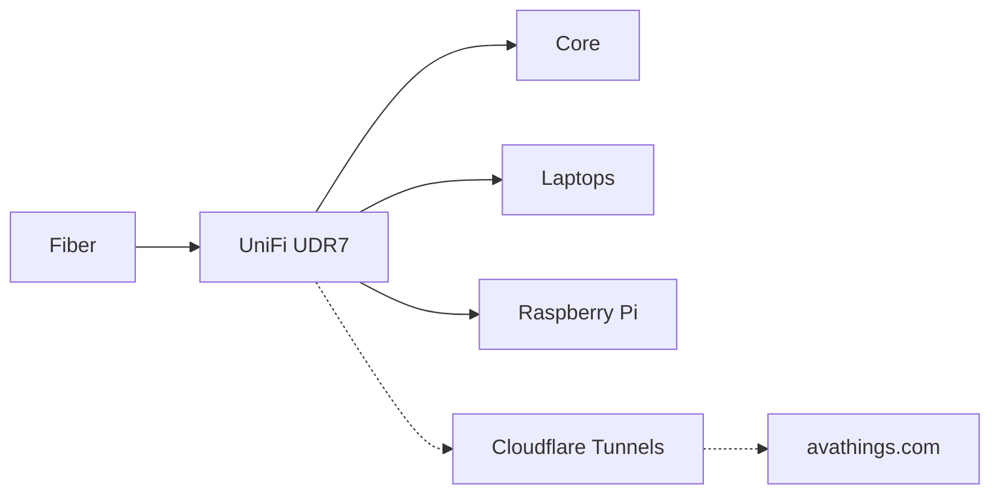

# 🏠 The Lab

All my tech and how it's set up. Everything runs on hardware I own, in my house, on batteries that keep it alive when the power drops.

---

## 🖥️ The Machines

| Machine | Hardware | Role |
| :--- | :--- | :--- |
| **Core** | 24-core CPU, 128 GB RAM, NVIDIA RTX Ada 5000 | Primary workstation & server node. Runs local models, databases, and background services behind Cloudflare Tunnels. |
| **Laptop 1** | x86_64 Linux laptop | Mobile dev machine (couch / recliner driver). |
| **Laptop 2** | x86_64 Linux laptop | Backup server node and failover box. |
| **Raspberry Pi 500+** | ARM edge board | Network tinkering and sandbox toy (mostly collects dust in the corner). |

Core handles heavier local compute while the laptops run [ChangeState](../projects/changestate.md) and [avabatt](../projects/avabatt.md) for thermal and battery preservation.

---

## 🌐 Network

Fiber comes in, a UniFi UDR7 routes it, and Core handles DNS for every device through AdGuard Home. Trackers and junk domains get blocked before traffic leaves the house.

Public sites like [avathings.com](https://avathings.com) go out through Cloudflare Tunnels, so I don't open any ports on my router.

---

## 🔋 Power

Three Anker Solix power stations sit between the wall and the gear:

- **Solix 1:** the fiber box and the UDR7, so the internet stays up in an outage.
- **Solix 2:** Core, so databases and long-running jobs finish cleanly.
- **Solix 3:** the laptops and dev gear.

---

## 🧰 The Software

- **Ollama** on Core serves AI models over a private API. No cloud bill, and nothing leaves the house.
- **MongoDB + Celery** handle background jobs. Fetched data gets parsed, queued, and saved to NVMe storage.
- If the internet goes down, local agents and models keep working.
