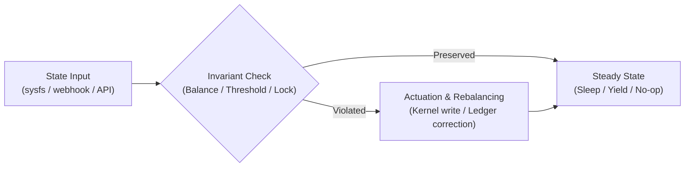

# Systems Thinking: From Balance Sheets to Linux Kernels

> **An ERP system, an enterprise ledger, and an operating system kernel are the exact same problem: state machines under constraint.**  
> Everything is state transition, balance conservation, and invariant preservation.

---

## 1. The Core Insight: Everything is Double-Entry

My analytical foundation wasn't born in computer science academia—it was forged in **Production & Operations Management, NetSuite ERP administration, and double-entry accounting**.

In software, people frequently get lost in syntax, framework fads, and UI veneer. When you have an accounting and operational background, you see every system through a much sharper lens:

| Domain | Invariant / Constraint | Failure Mode |
| :--- | :--- | :--- |
| **Accounting** | $\sum \text{Debits} = \sum \text{Credits}$ | Out-of-balance ledger, audit failure |
| **Supply Chain / Operations** | $\text{Inflow} - \text{Outflow} = \Delta \text{Inventory}$ | Stockouts, dead inventory, throughput bottlenecks |
| **Linux Systems / Kernel** | Conservation of memory/thermal envelopes | OOM killer, thermal throttling, deadlock |
| **Distributed / Edge Apps** | Idempotency, deterministic state reconciliation | Split-brain, race conditions, silent data corruption |

If you cannot define the **invariants** of a system, you do not understand the system.

---

## 2. Invariants Over Implementation

When building systems—whether an autonomous Linux thermal daemon ([ChangeState](../projects/changestate.md)) or a battery conservation tool ([avabatt](../projects/avabatt.md))—the goal is never "writing code." The goal is establishing and enforcing invariants:

### The Rules of System State:
1. **Zero Phantom State**: State that exists only in volatile, untracked memory will inevitably desynchronize. State must live in ground-truth interfaces (the kernel virtual filesystem, durable databases, or atomic journals).
2. **Deterministic Rebalancing**: When a system drifts from its target envelope, corrective actuation must be prime-cadenced or throttled to avoid harmonic resonance and thrashing.
3. **Idempotent Actuation**: Applying a desired state three times must have the exact same physical outcome as applying it once.

---

## 3. The Analyst Advantage in Software Engineering

Writing code is a translation layer. The hard part of software engineering is **business and physical requirements modeling**:
- What are the true bottleneck constraints (Theory of Constraints / Goldratt)?
- What is the cost of latency vs. the cost of inconsistency?
- Where is the human error surface, and how can the system make invalid states impossible to represent?

Because my center of gravity is rooted in operations and business systems, I do not design software in a vacuum. Every daemon, script, and API is evaluated against operational viability:
- **Cost**: Can it run at $0.00/mo cloud spend on edge hardware?
- **Maintenance**: Will this require human babysitting at 3 AM?
- **Resilience**: When upstream APIs fail, does it fail closed, log deterministically, and preserve state?
