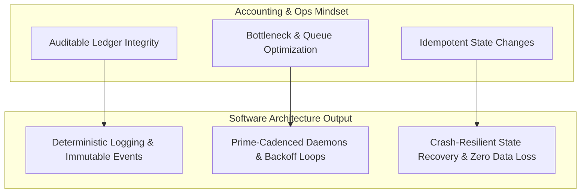

# Operations, ERP, & Systems Analysis Background

> **Enterprise systems at scale are high-stakes, multi-variable optimization problems.**  
> Grounding software architecture in formal business logic, double-entry accounting integrity, and supply chain realities.

---

## 1. Academic & Disciplinary Core

- **Degree**: Production & Operations Management
- **Minor**: Accounting
- **Core Competencies**:
  - Theory of Constraints (Goldratt) & Bottleneck Analysis
  - Double-Entry General Ledger Integrity & Audit Defensibility
  - Material Requirements Planning (MRP) & Inventory Cycle Dynamics
  - Queuing Theory, Throughput Modeling, & Statistical Process Control

---

## 2. NetSuite Administration & E-Commerce Infrastructure

Enterprise Resource Planning (ERP) systems are the ultimate real-world test for systems thinkers: bad data schemas halt warehouse fulfillment, and out-of-sync API webhooks trigger cascading financial discrepancies.

### Core Operational Arenas:
- **NetSuite ERP Administration**:
  - Custom record modeling, transaction workflows (SuiteFlow), and role-based access control (RBAC).
  - Saved searches, analytical reporting, and financial reconciliation pipelines.
  - Intercompany eliminations, multi-currency accounting, and inventory valuation (FIFO, average costing, standard costing).
- **Omnichannel E-Commerce Integration**:
  - Bidirectional synchronization between e-commerce store fronts, warehouse management systems (WMS), and the central NetSuite ledger.
  - Handling edge cases in distributed fulfillment: partial shipments, inventory allocations, backorders, and return/refund reconciliation.
  - Rate limiting, failure recovery, idempotency keys, and webhook validation across disparate 3rd-party APIs.

---

## 3. How ERP & Operations Shape Software Engineering

Most software engineering portfolios talk about web frameworks or syntax micro-benchmarks. Having an ERP and operations foundation shifts focus to what actually matters in production:

1. **Every Event Must Be Auditable**: If a system modifies state without a permanent, immutable record of *why* and *when*, it is defective.
2. **Operations Over Hype**: An elegant piece of code that costs \$500/month in cloud overhead or requires manual human intervention is an operational failure. True engineering delivers zero-overhead, durable automation.
3. **Translating Business Chaos to Code Contracts**: The hardest part of software isn't writing functions—it's extracting ambiguous, chaotic business constraints and codifying them into rigid, testable invariants that an autonomous agent swarm can safely implement.
