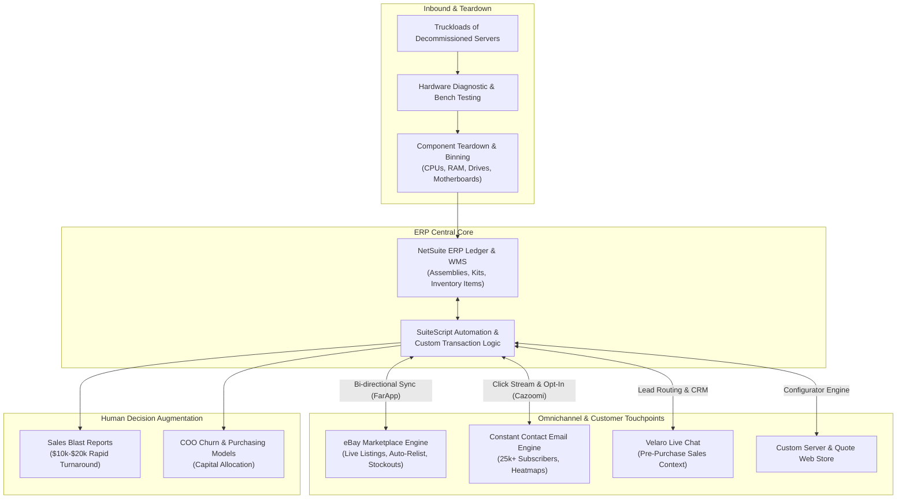

# Operations, ERP, & Systems Analysis Background

> **Enterprise systems at scale are high-stakes, multi-variable optimization problems.**  
> Grounding software architecture in formal business logic, double-entry accounting integrity, and supply chain realities.

---

## 1. Academic & Disciplinary Core

- **Degree**: Production & Operations Management
- **Minor**: Accounting
- **Core Competencies**:
  - Theory of Constraints (Goldratt) & Bottleneck Analysis
  - Double-Entry General Ledger Integrity & Audit Defensibility
  - Material Requirements Planning (MRP) & Inventory Cycle Dynamics
  - Queuing Theory, Throughput Modeling, & Statistical Process Control

---

## 2. Enterprise Case Study: Server Lifecycle & Custom Systems Manufacturing

Before engineering Linux daemons and directing autonomous AI agents, I served as the systems analyst and technical integration lead for a high-volume hardware refurbishing, e-commerce, and custom server manufacturing enterprise. 

**The Business Model**: Buy data center hardware by the truckload (thousands of servers), test components at scale, tear them down to bare chassis/boards/CPUs/RAM, and dynamically re-manufacture custom computer and server configurations for clients across web and marketplace channels.

This environment was a crucible for end-to-end systems thinking: physical warehouse operations, volatile multi-component inventory, high-velocity listing channels, and real-time sales order execution all converged on a single transactional core.

---

## 3. Flagship Integrations & Vendor Engineering

Rather than simply operating commercial software, I identified operational bottlenecks, drafted RFC-level requirements, pitched executive management, collaborated directly with software founders on protocol improvements, executed the rollouts, and supported them in production for years.

### A. Near-Real-Time Marketplace Sync: eBay & FarApp
- **Vendor & Counterpart**: Worked directly over 12+ months with Steve Greiner (founder of FarApp, later acquired by Oracle as NetSuite Connector).
- **The Challenge**: Managing thousands of volatile, fast-moving hardware SKUs across eBay and NetSuite using legacy manual tools (TurboLister) resulted in overselling out-of-stock items, phantom orders, and immense manual overhead.
- **Architectural Solution**: Built a robust, near-real-time synchronization layer mapping custom NetSuite fields to live eBay listings.
  - Automated inventory level sync to immediately kill listings when components fell below minimum safety thresholds.
  - Bidirectional sales order ingestion with automated customer feedback tracking.
  - Synchronized live eBay listing metrics directly back into NetSuite saved searches and reports for profitability analysis.

### B. CRM & Behavioral Opt-In Pipeline: Constant Contact & Cazoomi
- **Vendor & Counterpart**: Collaborated over 6+ months with Clint Wilson (founder of Cazoomi).
- **The Challenge**: A 25,000+ subscriber customer list required manual, bi-weekly spreadsheet exports and reconciliations to maintain opt-in hygiene, wasting hours of operational time and risking compliance infractions. This was Cazoomi's largest enterprise deployment to date.
- **Architectural Solution**: Engineered a bi-directional sync engine between NetSuite customer entities and Constant Contact lists.
  - Automated opt-in/opt-out status propagation with zero manual intervention.
  - **Click-Stream Behavioral Ingestion**: Co-developed a novel data bridge attaching email click activity directly to the customer entity in NetSuite. Sales reps could immediately see which specific hardware components or systems a prospect inspected.

### C. Contextual Lead Attribution: Velaro Live Chat
- **The Challenge**: Inbound sales leads on high-ticket custom servers lacked CRM context, causing reps to spend critical minutes looking up purchase histories while leads went cold.
- **Architectural Solution**: Integrated Velaro live chat with NetSuite CRM, automatically looking up returning customer records, assigning lead sources, and equipping reps with instant purchase histories.
- **Impact**: Attributed \$60,000–\$100,000 in direct new business while slashing time-to-resolution for support tickets.

---

## 4. Operational Tooling & SuiteScript Automation

Enterprise systems fail when humans are forced to be the glue between fragmented interfaces. I wrote SuiteScripts and designed NetSuite interfaces to make invalid operational states impossible:

### Custom Item Modeling & Web Configurators
- **Assemblies vs. Kits vs. Inventory Items**:
  - *Simple Parts*: Minimalist, fast-entry forms for raw components.
  - *Assemblies*: Pre-configured building blocks (e.g., matching chassis + motherboard pairs) with allocation logic that reserved components while calculating how many complete kits could be manufactured with existing stock.
  - *Dynamic Kits*: Built an interactive server configurator and quote builder for the e-commerce storefront, allowing clients to customize CPUs, memory, drive arrays, and controller cards with real-time compatibility and pricing checks.

### Context-Aware Sales Order Validation
- **Tiered Verification Workflows**: Replaced generic order entry with state-aware forms. Basic components processed with minimal gating; custom multi-node server orders enforced automated compatibility checks, component allocation locks, and mandatory accounting credit verification before moving to the warehouse queue.
- **Expedited Order Logic**: Injected priority escalation rules into warehouse fulfillment queues to re-sequence pick/pack tasks for expedited rush builds.

### Sales Rep Enablement & Decision Feeds
- **Next-Day Click-to-Close Reports**: Automated reports delivered to sales reps the morning after an email blast, isolating customers who clicked high-value server components but did not complete checkout. Reps engaged hot leads same-day, consistently generating **\$10,000–\$20,000 in incremental revenue** within 48 to 72 hours.
- **Automated Sales Rolling Metrics**: Nightly SuiteScripts calculating rolling customer lifetime value (LTV), velocity of top-performing SKUs, and territory time-zone segmentations.

---

## 5. Operations & Executive Insight (Reporting to COO)

Directly partnered with the Chief Operating Officer to transform raw transactional ledgers into capital allocation decisions:
- **Inventory Churn & Obsolescence**: Modeled component turnover velocity against warehouse shelf-life to identify decaying silicon before market prices crashed.
- **Purchasing Decision Models**: Combined historical component teardown yields with eBay marketplace clearing prices to model whether buying a specific truckload of decommissioned data center servers was profitable.
- **Role-Based Governance**: Fine-grained NetSuite permissions, audit logs, and search access control to ensure departmental separation of concerns without stifling operational speed.

---

## 6. The Through-Line: From ERP Systems to AI-Native Development

This background dispels any myth that building AI-native systems is a random pivot. The operational principles are identical:

| 2010s Business Systems Integration | 2020s AI-Native Systems Engineering |
| :--- | :--- |
| **NetSuite ERP + SuiteScript** | **Linux Kernel, Bash, Python, & Git** |
| Connecting eBay, email, warehouse, and ledger | Connecting autonomous agent swarms, tool harnesses, and APIs |
| Eliminating manual data re-entry and human spreadsheet glue | Eliminating human syntax authoring through prompt-as-RFC specs |
| Invariant: Inflow $-$ Outflow = $\Delta$ Inventory; General Ledger balance | Invariant: In-memory cache consistency, zero phantom state, thermal caps |
| Partnering with founders to fix API edge cases and sync loops | Directing multi-agent swarms to verify edge cases and test invariants |

Whether orchestrating an inventory teardown pipeline across marketplaces or coordinating autonomous AI agents across Linux daemons, the core competency is unchanged: **investigate the operational reality, design the feedback loops, codify the invariants, eliminate manual friction, and ensure the entire system behaves as a single coherent machine.**
