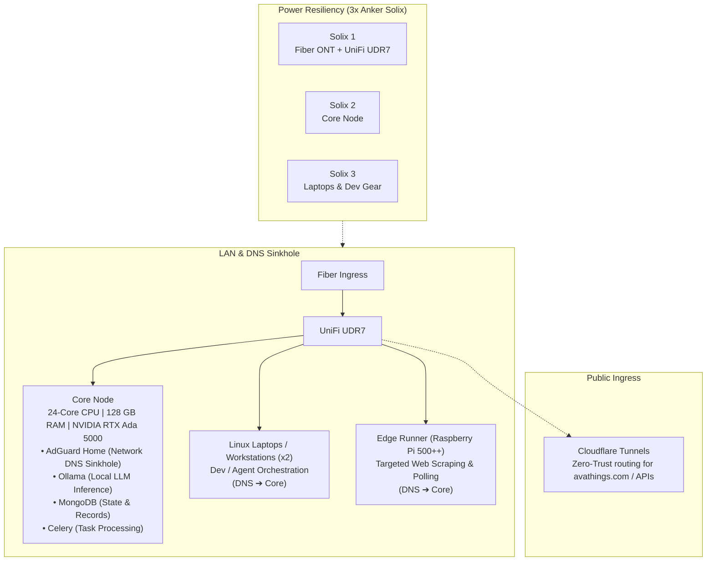

# Lab & Hardware Infrastructure

> **Operating Philosophy**: Treat local compute as a resilient private cloud. No enterprise over-engineering or synthetic complexity—hardware allocation follows the **Theory of Constraints**, matching actual physical Silicon and power to the demands of distributed workloads and autonomous agent loops.

---

## 1. Environment & Flow



---

## 2. Node Roles & Workload Allocation

Rather than sprawling hardware aimlessly, each node fills a specific, constrained operational tier:

| Node | Spec | Role & Workload | Rationale |
| :--- | :--- | :--- | :--- |
| **Core** | 24-Core / 128 GB RAM / NVIDIA RTX Ada 5000 | Heavy LLM inference (Ollama), AdGuard Home, MongoDB persistence, Celery task workers | Heavy-lifting anchor. Houses centralized storage, large memory buffers, and dedicated GPU silicon. |
| **Linux Laptops (x2)** | Multi-core x86_64 Linux | Interactive development, agent orchestration, secondary inference | High-duty portable and desk nodes. Preserved against thermal thrashing and battery swelling via [avabatt](../projects/avabatt.md) and [ChangeState](../projects/changestate.md). |
| **Edge Runner** | Raspberry Pi 500++ | Targeted scraping, external API polling, webhook monitors | **Constrained on purpose.** High-frequency untrusted web I/O is kept on isolated cheap silicon instead of dirtying or loading primary compute. |

---

## 3. Network & DNS Sinkhole (AdGuard Home)

The network philosophy is dead simple: plug into fiber, let the UniFi UDR7 route traffic, and make **Core** the intelligence hub of the entire local network:

- **AdGuard Home on Core**: The Core node runs an AdGuard Home DNS sinkhole.
- **Centralized Resolution**: All LAN devices (laptops, Pi, mobile, and peripherals) point their primary DNS to Core.
- **Telemetry & Tracker Blocking**: Upstream tracking, malicious domains, and ad telemetry are blocked at the resolver level before traffic leaves the premises.
- **Public Ingress**: Public services (such as [avathings.com](https://avathings.com) and webhook endpoints) route through Cloudflare Tunnels, avoiding exposed port forwards on the local router.

---

## 4. Power Resiliency: 3x Anker Solix

A machine room without power insulation is just an outage waiting to happen. The entire setup is buffered by 3x Anker Solix portable power stations:

```
[Utility Grid]
     │
     ├─► [Anker Solix 1] ──► Fiber ONT + UniFi UDR7 (Internet stays live during power cuts)
     ├─► [Anker Solix 2] ──► Core Node (Protects Ada 5000 runs, DB writes, and Ollama)
     └─► [Anker Solix 3] ──► Linux Laptops & Active Dev Stations
```

- **Zero-Blink Fiber**: Fiber ONT and the UDR7 stay powered independently. Grid drops or utility flicker do not disrupt long-running agent tasks or active TCP sessions.
- **Data Protection**: MongoDB and Celery queues avoid dirty shutdowns and journal recovery headaches.

---

## 5. Software Stack & Failure Modes

- **Ollama on Core**: Quantized foundation models served locally via private REST API, powering autonomous agent tasks without SaaS cost or cloud telemetry.
- **MongoDB + Celery**: Asynchronous worker pipeline where batch jobs and web fetch results are parsed, queued, and committed to durable NVMe storage.
- **Grid / WAN Resilience**:
  - If the external grid goes dark, the Solix units absorb the drop seamlessly.
  - If the WAN connection degrades, local agent workflows and local models continue running uninterrupted against local Ollama endpoints and internal document stores.
