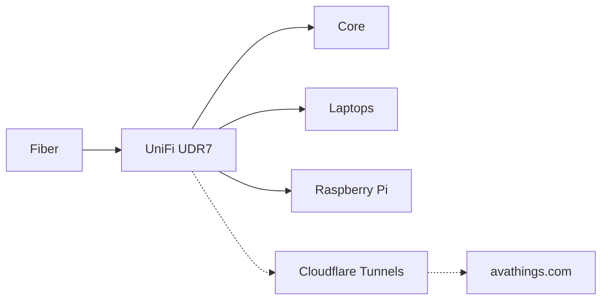

# 🏠 The Lab

All my tech and how it's set up. Everything runs on hardware I own, in my house, on batteries that keep it alive when the power drops.

---

## 🖥️ The Machines

| Machine | What it is | What it does |
| :--- | :--- | :--- |
| **Core** | 24-core CPU, 128 GB RAM, NVIDIA RTX Ada 5000 | Runs the heavy stuff: local AI models ([Ollama](https://ollama.com)), the network's DNS filter ([AdGuard Home](https://adguard.com/adguard-home.html)), MongoDB, and Celery workers. |
| **Linux laptops (x2)** | Everyday x86_64 Linux machines | Where I write code and run AI agents. [ChangeState](projects/changestate.md) keeps them cool and [avabatt](projects/avabatt.md) protects the batteries. |
| **Edge runner** | Raspberry Pi 500++ | Does the web scraping and polling, so risky internet traffic stays off my main machines. |

Core serves both [AvaScry](projects/avascry.md) and avathings.com behind Cloudflare Tunnels. I toggle off CPU cores on Core to keep it cool and low-power when serving web traffic.

---

## 🌐 Network

Fiber comes in, a UniFi UDR7 routes it, and Core handles DNS for every device through AdGuard Home. Trackers and junk domains get blocked before traffic leaves the house.

Public sites like [avathings.com](https://avathings.com) go out through Cloudflare Tunnels, so I don't open any ports on my router.

---

## 🔋 Power

Three Anker Solix power stations sit between the wall and the gear:

- **Solix 1:** the fiber box and the UDR7, so the internet stays up in an outage.
- **Solix 2:** Core, so databases and long-running jobs finish cleanly.
- **Solix 3:** the laptops and dev gear.

---

## 🧰 The Software

- **Ollama** on Core serves AI models over a private API. No cloud bill, and nothing leaves the house.
- **MongoDB + Celery** handle background jobs. Fetched data gets parsed, queued, and saved to NVMe storage.
- If the internet goes down, local agents and models keep working.

---

## 🧪 Experiments

TODO(dev): add agent experiments and bench tests here as they happen.
