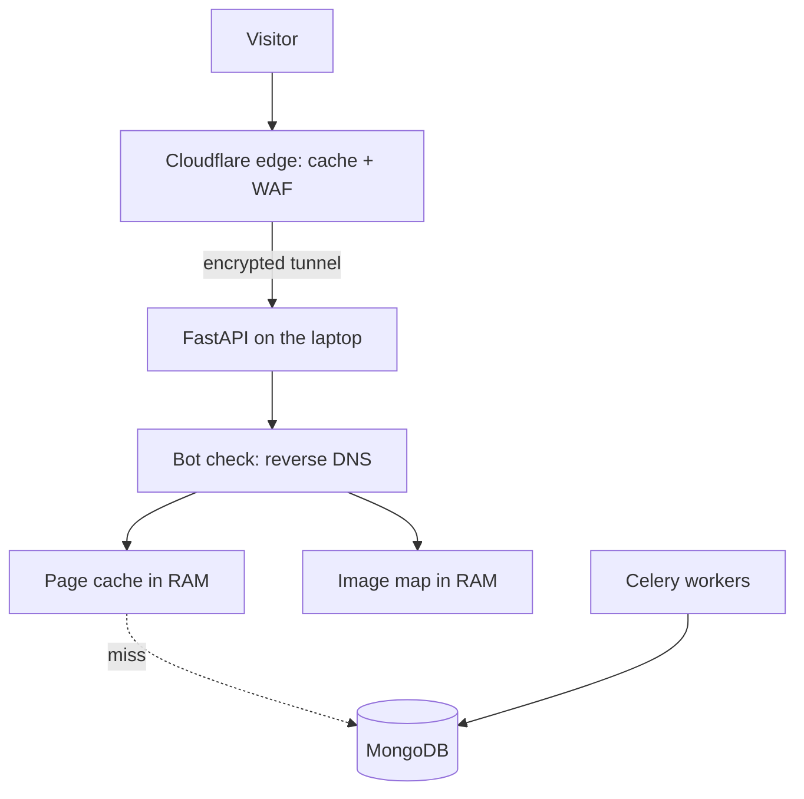

# 🔮 AvaScry

A card search site for Magic: The Gathering that cares about the old, odd, and forgotten printings. It indexes 500,000+ printings and a large pile of card art scans (340k+ is close enough). I run it on my Core node with some CPU cores toggled off to keep power and heat low, and there is no cloud bill.

Most card sites push you toward the popular cards. AvaScry goes the other way: premodern variants, foreign-language prints, and the printings nobody lists.

Live at avascry.com.

## 📏 What it feels like

| Thing | Typical number |
| :--- | :--- |
| Card pages | ~1–25 ms average response |
| Card images | ~1–5 ms average |
| Hosting bill | None. Just the laptop and power. |
| Launch stress test | About 3.5M requests in the first 7–10 days |

Most of that launch traffic came from AI scrapers (Meta, OpenAI, Anthropic and others). It was a rough first week and it shaped the defenses below.

## 🧩 How it works, short version

- **RAM does the serving.** Rendered card pages sit in an in-process cache. A hit skips MongoDB and template rendering entirely. The cache is saved to disk on shutdown so a restart doesn't start cold.
- **Images are a lookup, not a search.** On boot it builds an in-memory map of every scan file (808k files, a scan-file count, not a card count). Serving an image is one dictionary lookup.
- **MongoDB holds the truth.** The cache is disposable. The database is not.
- **No public IP.** Traffic comes in through Cloudflare and an encrypted tunnel to the laptop. Cloudflare also caches the static images.
- **Scraper defense.** Anything claiming to be Googlebot or Bingbot gets checked with a two-way DNS lookup. Fakes get a 403. Cloud datacenter IP ranges are blocked, and local reputation data syncs to Cloudflare firewall rules.
- **Background workers.** Celery, with MongoDB as the queue instead of Redis. Separate queues keep GPU jobs (embeddings, vision checks of card scans) away from lightweight ones.
- **Discord bot.** Slash commands run as signed webhooks (Ed25519), not through the Discord websocket, so they keep working if the gateway is down. It replies "thinking" right away, then sends the card image once it's ready.
- **Retry timing.** Retries use prime-number delays plus about ±17% jitter, so workers don't all retry at the same instant.

## 🔬 Deep dive

The author's own architecture notes are in the source repo under `docs/`:

- `01_system_architecture.md`, `02_memory_and_caching.md`, `03_data_layer_and_mongo.md`
- `05_discord_bot_architecture.md`, `06_bot_shield_and_edge_defense.md`

Related: [ChangeState](changestate.md), the tool that keeps the laptop cool.
