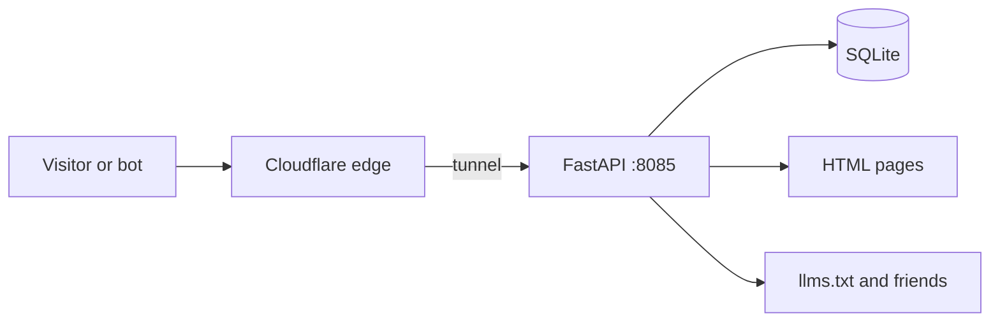

# 🌐 avathings-web

**The website for my Linux tools, at [avathings.com](https://avathings.com).** It has the command cheat sheets for changestate, avabatt and the applet, written for people and for AI assistants that need to answer questions about them.

It runs on my own hardware behind a Cloudflare Tunnel. No cloud bill, just local machines and power.

---

## 🤖 Made for people and bots

Alongside normal pages, the site serves:

- `/llms.txt`: short summary, following the [llmstxt.org](https://llmstxt.org) convention
- `/llms-full.txt`: full docs and cheat sheet in one prompt-friendly file
- `/robots.txt`: lets AI crawlers in
- `/sitemap.xml`
- JSON-LD `SoftwareApplication` data on pages

The idea: when someone asks an assistant about these tools, it should find clean, accurate text instead of scraping a messy page. Whether that actually changes citations: TODO(dev): confirm.

I built it with an AI pair-programmer, start to finish.

## 🚀 Run it locally

```bash
source venv/bin/activate
uvicorn app.main:app --host 127.0.0.1 --port 8085 --reload
```

## 🔒 Deploy

```bash
sudo cp avathings-web.service /etc/systemd/system/
sudo systemctl daemon-reload
sudo systemctl enable --now avathings-web.service
```

`cloudflared` maps `avathings.com` and `www.avathings.com` to `127.0.0.1:8085`. See `cloudflared-example.yml` in the repo. Because the tunnel dials out, I open no inbound firewall ports.

---

## 🔧 How it works

- **Backend:** FastAPI on Python 3.12, templates in Jinja2.
- **Docs:** `docs_service.py` renders markdown docs into pages.
- **Visit log:** `aiosqlite` stores path, user agent and a truncated SHA-256 of the client IP in `avathings.db`. No third-party analytics. Hashing is a privacy nudge, not anonymity; IPv4 space is small. TODO(dev): confirm whether the hash is salted (the code I saw isn't).
- **Process:** systemd restarts it on failure.



## 🧩 Related

[avabatt](avabatt.md) · [avathings-applet](avathings-applet.md) · [changestate](changestate.md)
